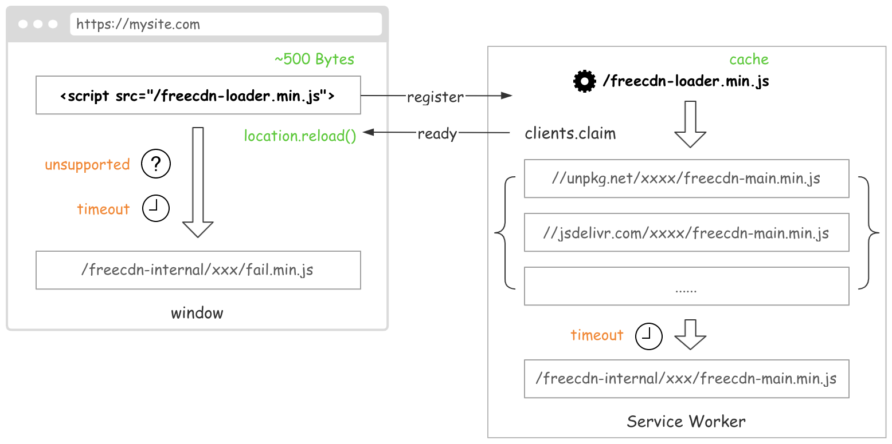

# freecdn-js

[freecdn](https://github.com/EtherDream/freecdn) 前端脚本。

# 结构

* core-lib：核心库（可脱离 Service Worker 运行，方便开发和测试）

* main-js：主程序（静态链接 core-lib）

* loader-js：加载器（体积极小，动态加载 main-js）

* fail-js：异常处理

# 特性

## 体积

loader-js 仅保留 Service Worker 基本功能，压缩后只有几百字节，从而能更快加载，尽早开启请求拦截。

完整功能放在 main-js，该脚本默认从公共 CDN 加载，最大程度节省当前站点流量。

## 安全

loader-js 加载 main-js 时会校验其 Hash 值，如果和预期不一致则拒绝执行，避免 CDN 风险。

Hash 值是硬编码在 loader-js 中的，因此不存在热更新的现象。即使脚本有升级，开发者必须主动更新才会生效。

## 稳定

为了避免公共 CDN 不稳定因素，loader-js 同时从多个 CDN 加载 main-js，哪个先完成运行哪个，用流量换时间。如果 CDN 都不可用，则从当前站点加载 main-js。

这些额外的流量也不是完全浪费。因为提前和多个 CDN 进行预热，之后访问会更快。并且这几个文件的加载时间，还会用于各个 CDN 的性能评估。

## 兼容

loader-js 生成 ES3 语法，可兼容所有浏览器。运行时会检测浏览器是否支持 ES2020，支持则加载 main-js，否则加载 fail-js，做一些不支持的处理。

如果 CSP 策略导致 Service Worker 无法执行 eval，loader-js 也会加载 fail-js。（页面存在 CSP 无影响）

## 复用

loader-js 既能在页面中运行，也能在 Service Worker 中运行。在控制台网络栏中可见该脚本会出现两次。

## 安装过程

如果 Service Worker 安装成功，页面会立即刷新；如果浏览器不支持或安装超时，页面会加载 fail-js 进一步处理异常情况。

Service Worker 安装后，页面加载 loader-js 得到的不再是原先内容，而是被拦截替换成 freecdn 页面层的功能代码。该模块目前未开发，之后会用于 WebRTC 等 Service Worker 无法实现的功能。

# 使用

实际使用时通过工具生成前端脚本：

    freecdn js --make

因为 loader-js 包含公钥信息，所以文件内容是不固定的。通过工具生成可自动写入公钥。

# 调试

为本项目创建全局链接：

    npm link

进入 freecdn 项目，使用本地 freecdn-js 包代替远程版本：

    npm link freecdn-js

同时 freecdn 项目也可通过 `npm link` 创建全局链接，之后执行 `freecdn` 命令时直接使用本地版本。

# 编译

本项目所有模块都使用 TypeScript 开发。执行：

    npm run dev

之后源文件有变化时会自动编译相应的模块，生成的 JS 位于 dist 目录。

配合调试的站点，使用开发模式创建前端文件：

    freecdn js --make --dev

开发模式有如下特征：

* 前端文件创建在 `freecdn-internal/dev` 目录，而不是 `freecdn-internal/$VER` 目录

* `freecdn-internal/dev` 中的文件使用 `link` 的方式和本项目 dist 中的文件保持同步

* 前端脚本不会加载外部站点的资源，总是从当前站点 `freecdn-internal/dev` 加载

* 前端脚本使用未压缩的版本，方便调试

* 前端源码中 `IS_DEBUG` 条件变量为 true

# 压缩

    npm run build

本项目使用 [terser](https://github.com/terser/terser) 对 JS 进行压缩，生成相应的 .min.js 文件。